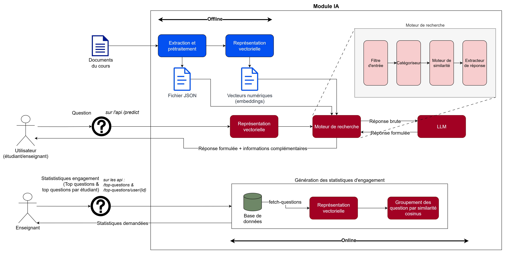

# 🤖 Assistant Pédagogique Intelligent

## 📌 Présentation

L'**Assistant Pédagogique Intelligent** est une application basée sur l'intelligence artificielle permettant de répondre automatiquement aux questions des étudiants à partir du contenu officiel d'un cours sous forme de présentations PowerPoint.

L'objectif est double :

* 🎓 **Aider les étudiants** à retrouver rapidement les informations présentes dans les supports de cours.
* 👨‍🏫 **Aider les enseignants** à suivre l'engagement des étudiants grâce à des indicateurs et tableaux de bord.

L'assistant utilise plusieurs techniques de traitement automatique du langage naturel (NLP) :

* Extraction automatique du contenu des diapositives
* Représentation vectorielle des documents
* Recherche sémantique par similarité
* Classification des questions
* Extraction des réponses les plus pertinentes

---

# ✨ Fonctionnalités

### Pour les étudiants

* Poser des questions en langage naturel.
* Recherche sémantique dans l'ensemble du cours.
* Identification du chapitre et de la diapositive concernés.
* Extraction automatique de la réponse la plus pertinente.
* Catégorisation des questions :

  * Définition
  * Formule
  * Exemple
  * Remarque

### Pour les enseignants

* Analyse des interactions étudiants.
* Suivi des questions les plus fréquentes.
* Tableau de bord d'engagement.
* Statistiques d'utilisation.

---

# 🏗️ Architecture Générale



---

# 📁 Structure du Projet

```text
assistant-pedagogique/
│
├── data/
│   │
│   ├── 1-ppt/
│   │   ├── Cours_TS_Chap1.pptx
│   │   └── Cours_TS_Chap2.pptx
│   │
│   ├── 2-json/
│   │   └── cours.json
│   │
│   ├── 3-numerical/
│   │   ├── slide_embeddings.npy
│   │   ├── slides_metadata.json
│   │   ├── tf_matrix.npz
│   │   ├── tf_vectorizer.pkl
│   │   ├── tfidf_matrix.npz
│   │   └── tfidf_vectorizer.pkl
│   │
│   └── extracted_images/
│       ├── chapitre1/
│       └── chapitre2/
│
│
│
├── notebooks/
│   ├── pretraitement.ipynb
│   ├── extraction_caracteristiques_textuelles.ipynb
│   ├── extraction_caracteristiques_engagement.ipynb
│   └── assistant_demo.ipynb
│
├── src/
│   ├── routes/
│   │   ├── __init__.py
│   │   ├── predict.py
│   │   └── top_questions.py
│   │
│   ├── __init__.py
│   ├── assistant.py
│   ├── config.py
│   ├── database.py
│   └── stats.py
│
├── main.py
├── .gitignore
└── README.md
```

---

# 📚 Description des Dossiers

## data/

Contient toutes les données utilisées par le projet.

### 1-ppt/

Contient les présentations PowerPoint originales du cours.

### 2-json/

Contient les données structurées extraites des diapositives.

### 3-numerical/

Contient les représentations numériques utilisées pour la recherche sémantique :

* TF
* TF-IDF
* Embeddings E5
* Métadonnées

### extracted_images/

Images extraites automatiquement depuis les diapositives.

---

## notebooks/

Ce dossier regroupe deux types de notebooks aux rôles distincts :

- **Pipeline offline** : `pretraitement.ipynb` et `extraction_caracteristiques_textuelles.ipynb` font partie intégrante du système. Ils sont exécutés en amont, une seule fois, pour préparer les données utilisées ensuite par l'application en production.
- **Prototypes de recherche** : `extraction_caracteristiques_engagement.ipynb` et `assistant_demo.ipynb` sont des outils d'exploration et de test. Ils ne font pas partie de l'application en production et n'ont pas vocation à y être intégrés.

| Notebook                                     | Rôle        | Description                                                             |
| -------------------------------------------- | ----------- | ----------------------------------------------------------------------- |
| pretraitement.ipynb                          | Pipeline offline | Extraction du texte, des notions, catégories et formules depuis les PPT |
| extraction_caracteristiques_textuelles.ipynb | Pipeline offline | Génération des représentations TF, TF-IDF et Embeddings                 |
| extraction_caracteristiques_engagement.ipynb | Prototype        | Exploration des indicateurs d'engagement (hors production)              |
| assistant_demo.ipynb                         | Prototype        | Démonstration complète de l'assistant (hors production)                 |

---

## src/

Contient le code source principal de l'application.

| Fichier      | Rôle                                        |
| ------------ | ------------------------------------------- |
| assistant.py | Moteur principal de recherche et de réponse |
| config.py    | Paramètres de configuration                 |
| database.py  | Gestion des données                         |
| stats.py     | Calcul des statistiques                     |
| routes/      | Endpoints de l'API                          |

---

# 🧠 Pipeline de Traitement

## 1. Extraction

Les présentations PowerPoint sont analysées pour extraire :

* Les titres des chapitres
* Les sections
* Le texte
* Les formules
* Les images
* Les catégories pédagogiques
* Les notions clés

Résultat :

```text
cours.json
```

---

## 2. Vectorisation

Le contenu extrait est transformé en représentations numériques :

* Count Vectorizer (TF)
* TF-IDF
* Sentence Embeddings E5 Multilingue

Résultat :

```text
slide_embeddings.npy
slide_metadata.json
tf_matrix.npz
tf_vectorizer.pkl
tfidf_matrix.npz
tfidf_vectorizer.pkl
```

---

## 3. Recherche Sémantique

Lorsqu'un étudiant pose une question :

1. La question est encodée avec le modèle `multilingual-e5-base`.
2. Les slides sont filtrés par catégorie pédagogique (définition, formule, exemple…), puis classés par similarité cosinus.
3. La phrase la plus pertinente du slide retenu est extraite.
4. Si aucun résultat ne dépasse les seuils de confiance, l'assistant répond : *"Je ne connais pas la réponse dans le cours."*

## 4. Reformulation par LLM

La réponse brute extraite du cours est reformulée par le modèle `llama3.2` via Ollama pour la rendre fluide et lisible, sans modifier ni enrichir l'information d'origine.

Le prompt impose des règles strictes :
- Ne jamais ajouter d'informations absentes de la réponse brute.
- Ne jamais modifier les faits ou le sens.
- Répondre dans la même langue que la question.
- Si la réponse extraite n'est pas pertinente par rapport à la question, retourner : *"Je ne connais pas la réponse dans le cours."*

En cas d'erreur Ollama, la réponse brute est retournée telle quelle.

---

# 🚀 Installation étape par étape

## Prérequis

- **Python 3.9 ou supérieur**
- **MySQL** (XAMPP, WAMP, ou serveur MySQL autonome)
- **Git** (optionnel, pour cloner le dépôt)

## 1. Cloner ou télécharger le projet

```bash
git clone https://github.com/BesrourNour/assistant-pedagogique.git
cd assistant-pedagogique
```

## 2. Installer les dépendances

```bash
pip install python-pptx spacy sentence-transformers scikit-learn pandas matplotlib fastapi uvicorn joblib numpy scipy mysql-connector-python ollama tqdm lxml requests
```

## 3. Télécharger le modèle spaCy français

Le projet utilise spacy pour l'extraction des notions grammaticales.

```bash
python -m spacy download fr_core_news_sm
```

## 5. Installer Ollama et le modèle LLM

Télécharger et installer Ollama depuis [https://ollama.com/download](https://ollama.com), puis télécharger le modèle :

```bash
ollama run llama3.2
```

Ollama démarre généralement automatiquement en arrière-plan après l'installation. Pour vérifier :

```bash
ollama list
```
Vous devriez voir llama3.2 dans la liste.

Si ce n'est pas le cas, lancez le serveur manuellement :

```bash
ollama serve
```

### 6. Configuration de la base de données MySQL

La base de données `assistant_ts_db` ainsi que ses tables (`session_cours`, `interaction`) sont déjà créées et utilisées par l'application web du projet. **Vous n'avez donc pas besoin de les recréer**.

Il vous suffit de **configurer les identifiants de connexion** dans le fichier `src/config.py` pour qu'ils correspondent à votre environnement MySQL local.

Ouvrez `src/config.py` et modifiez la section suivante :

```python
DB_CONFIG = {
    'host': 'localhost',
    'user': 'root',        # votre utilisateur MySQL
    'password': '',        # votre mot de passe (vide par défaut sous XAMPP)
    'database': 'assistant_ts_db'
}
```
Assurez-vous que votre serveur MySQL est bien démarré (ex: via XAMPP, WAMP, ou service systemd).

---

# ▶️ Exécution

### Étape 1 : Prétraitement

> **À exécuter uniquement si `data/2-json/cours.json` n'existe pas encore.

```bash
pretraitement.ipynb
```

Génère :

```text
data/2-json/cours.json
```

### Étape 2 : Vectorisation

> **À exécuter uniquement si le dossier `data/3-numerical/` est absent ou incomplet.**

```bash
extraction_caracteristiques_textuelles.ipynb
```

Génère :

```text
data/3-numerical/
```

### Étape 3 : Tableau de bord (optionnel)

```bash
extraction_caracteristiques_engagement.ipynb
```

Génère :

```text
dashboard_engagement.csv
```

### Étape 5 : Démonstration de l'assistant avec quelques exemples

```bash
assitant_demo.ipynb
```

### Étape 6 : Lancer l'assistant

```bash
python main.py
```

---


# Tester l'API

L'API expose trois endpoints. Testez-les avec [Postman](https://www.postman.com/), curl, ou tout autre client HTTP.

### 1. Poser une question à l'assistant

`POST http://localhost:5000/predict`

```json
{
  "question": "C'est quoi système stable ?"
}
```

Réponse :

```json
{
    "chap_id": 2,
    "chap_name": "Systèmes linéaires continus",
    "slide_id": 9,
    "section": "Classification des systèmes",
    "category": "definition",
    "score": 0.8749,
    "reponse": "Un système stable est un système qui reste dans des limites prédéterminées en réponse à une entrée limitée. Cela signifie que la sortie du système ne dépasse pas les limites prévues et qu'elle reste dans un équilibre stable."
}
```

> Si la question est hors sujet, `chap_id` et `slide_id` seront `null` et `reponse` indiquera que l'assistant ne connaît pas la réponse.

---

### 2. Questions les plus fréquentes (global)

`GET http://localhost:5000/top-questions?k=5`

Le paramètre `k` (optionnel, défaut=5, max=20) spécifie le nombre de questions à retourner.

---

### 3. Questions les plus fréquentes d'un utilisateur

`GET http://localhost:5000/top-questions/user/{user_id}?k=5`

Remplacer `{user_id}` par l'identifiant numérique de l'étudiant.

---

# 👥 Auteurs

Projet réalisé dans le cadre du module PPP (Projet Professionnel Personnel).

Université / École : Institut National des Sciences Appliquées et de Technologies

Année universitaire : 2025-2026

---

# 📄 Licence

Projet académique réalisé à des fins pédagogiques.
